# 🌱 Smart Plant Disease Detection & Management App

A mobile application that helps users diagnose plant diseases and monitor their environments in real-time using sensors and AI. The app offers advanced features like plant scanning, disease prediction, smart agriculture services, and more.

---

## 🚀 Features

### 🧠 AI-Based Plant Diagnosis

- Scan plant leaves using your phone camera
- Detect if the plant is healthy or diseased
- Identify the disease type (if any)
- Provide suggested treatments

### 📊 Real-Time Sensor Monitoring

- Monitor real-time **pH Level**, **Soil Moisture**, **Temperature**, and **LDR sensor** values
- Data is visualized in an intuitive way for easy tracking

### 👥 User & Admin Roles

- **User**: Can scan plants, view sensor data, and request services
- **Admin**: Can add new plants/diseases, manage system content

### 📷 QR Code Integration

- Scan QR codes to add a **new area** or sensor setup easily

### 🧰 Agriculture Services

Users can request:

- Expert farmers
- Seeds
- Tools and machines for farming

---

## 🛠️ Technologies Used

- **Flutter** – Mobile App
- **Python + YOLOv5** – Plant Disease Detection
- **Firebase** – Authentication & Data Storage
- **Realtime Sensors** – PH, Moisture, LDR, Temperature
- **Google Drive** – Model hosting (due to GitHub limits)
- **QR Code** – Area/Sensor setup

---

## 🧠 Model Files

Due to GitHub's 100MB file size limit, trained model files are hosted externally:

- [`DataSet`]([https://drive.google.com/your-link-here](https://drive.google.com/file/d/1jJNEUCMRL5f5Fsr0i70lIGsONLyzqow1/view?usp=sharing))
https://drive.google.com/file/d/1jJNEUCMRL5f5Fsr0i70lIGsONLyzqow1/view?usp=sharing

---

## 📱 Screenshots

### 🧑‍🌾 User/Admin Interface

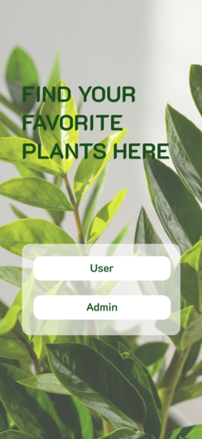

### 🔐 Authentication Screens

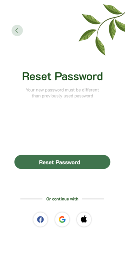  
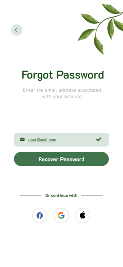  
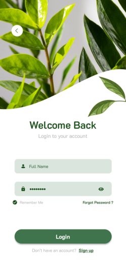  
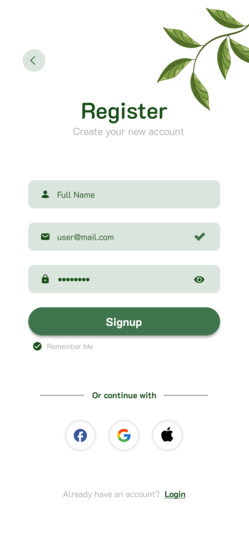  
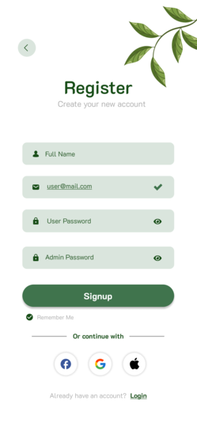

### 🧭 Navigation & Info

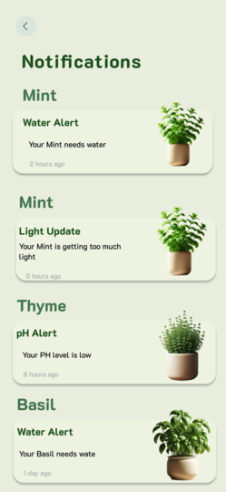  
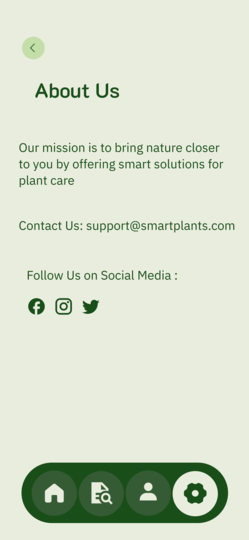

### 🪴 Plant Management

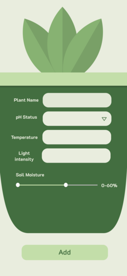  
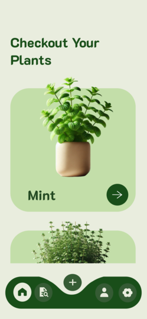

### 🔎 Browse & Reference

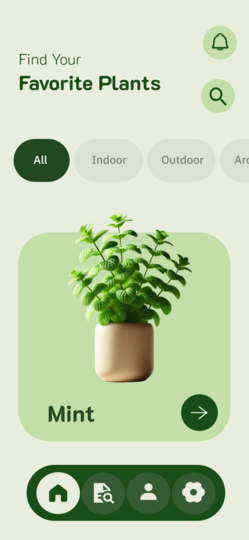  
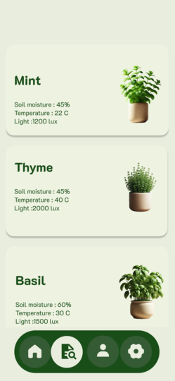

### ⚙️ Settings & Profile

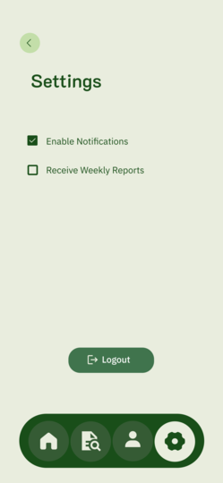  
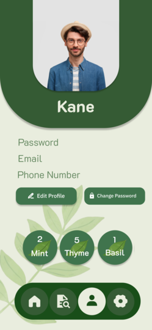

### 🔬 Scanning & Sensors

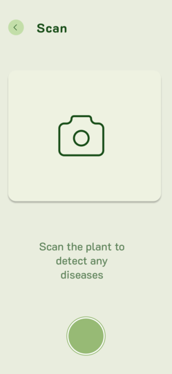  
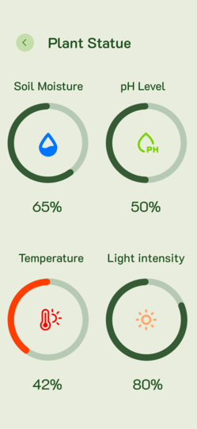

### 🌍 User’s Planet

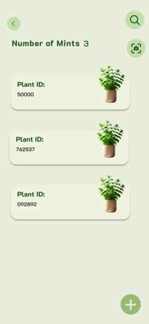

## 📌 Notes

- This app was developed as part of a **Graduation Project** for the Faculty of Computer Science & Artificial Intelligence.
- It combines mobile development, real-time IoT, and deep learning to support smarter agriculture.
